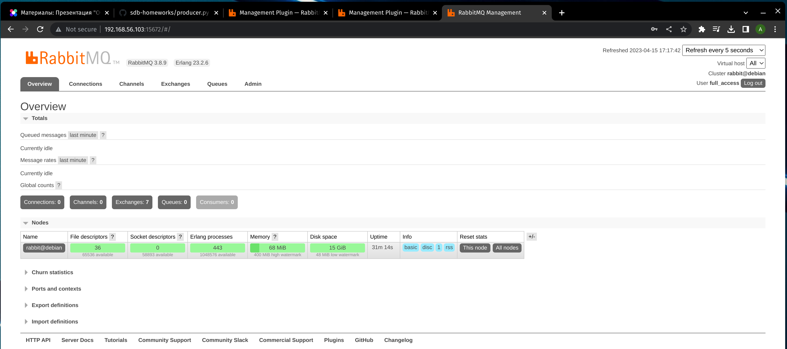
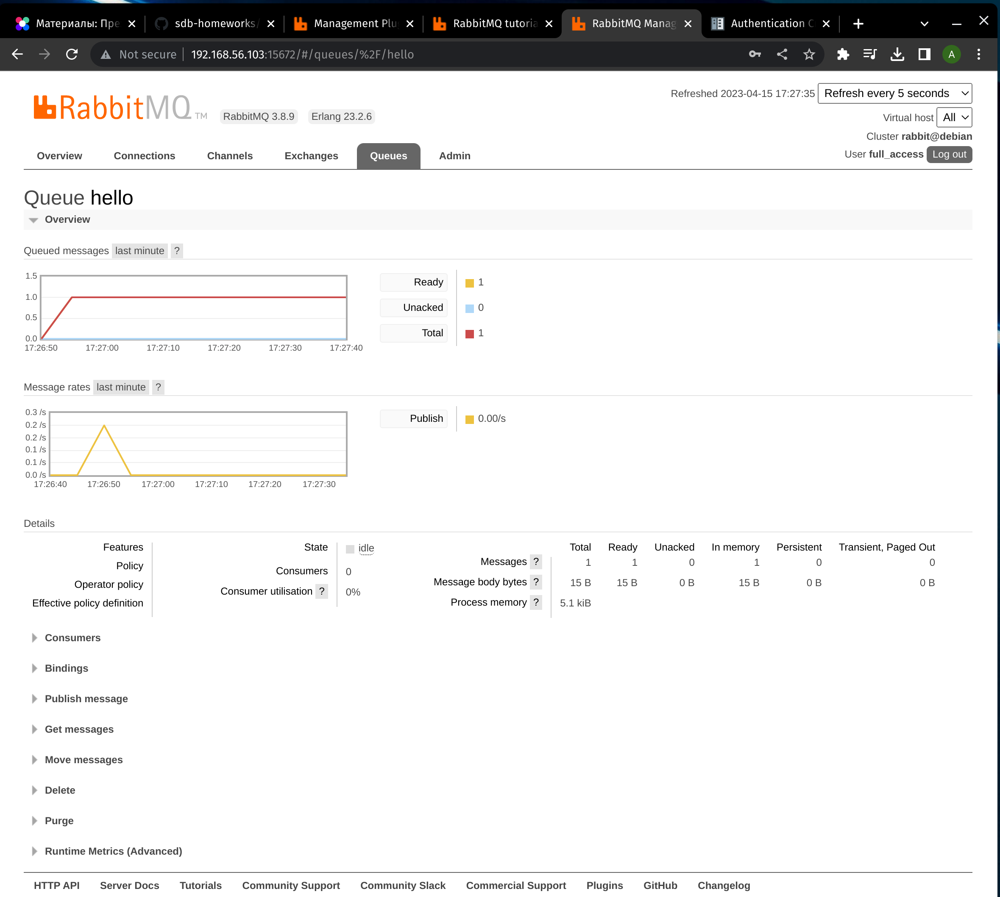
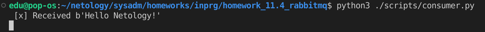
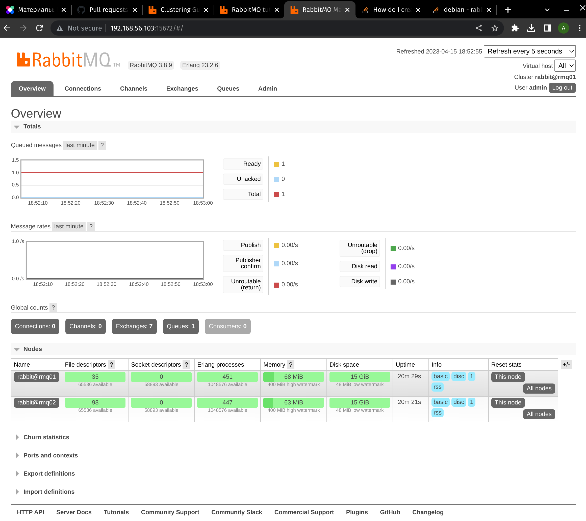
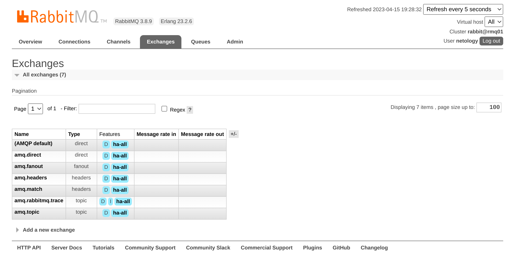
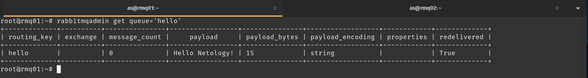
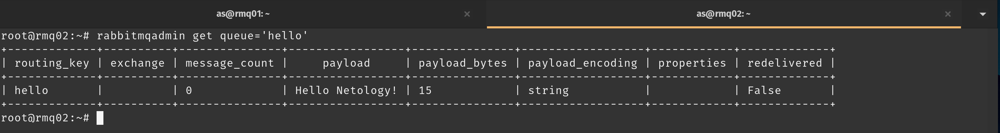
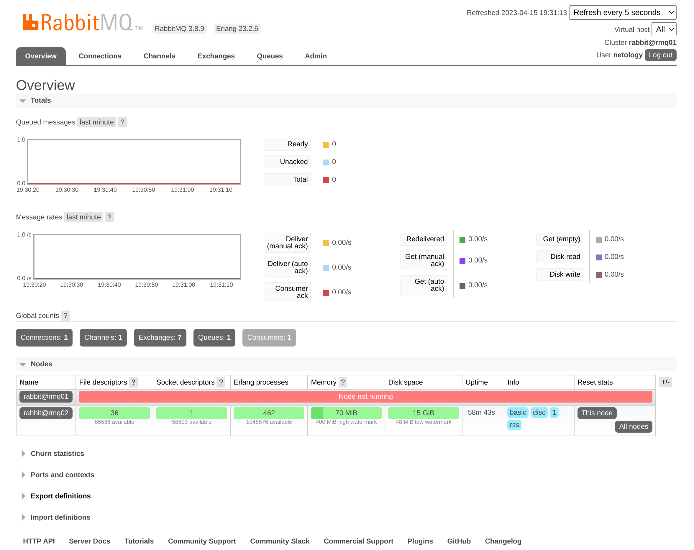
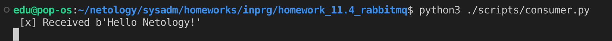

# Домашнее задание к занятию "`Название занятия`" - `Андрей Сотников`

---

### Задание 1. Установка RabbitMQ

> Используя Vagrant или VirtualBox, создайте виртуальную машину и установите RabbitMQ.
> Добавьте management plug-in и зайдите в веб-интерфейс.
>
> *Итогом выполнения домашнего задания будет приложенный скриншот веб-интерфейса RabbitMQ.*

---

### Задание 2. Отправка и получение сообщений

> Используя приложенные скрипты, проведите тестовую отправку и получение сообщения.
Для отправки сообщений необходимо запустить скрипт **producer.py**.
>
> Зайдите в веб-интерфейс, найдите очередь под названием hello и сделайте скриншот.
После чего запустите второй скрипт **consumer.py** и сделайте скриншот результата выполнения скрипта
>
> *В качестве решения домашнего задания приложите оба скриншота, сделанных на этапе выполнения.*

---

### Задание 3. Подготовка HA кластера

> Используя Vagrant или VirtualBox, создайте вторую виртуальную машину и установите RabbitMQ.
> Затем объедините две машины в кластер и создайте политику ha-all на все очереди.
>
> *В качестве решения домашнего задания приложите скриншоты из веб-интерфейса с информацией о доступных нодах в кластере и включённой политикой.*

> Также приложите вывод команды с двух нод:
>
> `rabbitmqctl cluster_status`

    
rmq01

Cluster status of node rabbit@rmq01 ...  
Basics  

Cluster name: rabbit@rmq01  

Disk Nodes

rabbit@rmq01
rabbit@rmq02

Running Nodes

rabbit@rmq01
rabbit@rmq02

Versions

rabbit@rmq01: RabbitMQ 3.8.9 on Erlang 23.2.6  
rabbit@rmq02: RabbitMQ 3.8.9 on Erlang 23.2.6

Maintenance status

Node: rabbit@rmq01, status: not under maintenance  
Node: rabbit@rmq02, status: not under maintenance

Alarms

(none)

Network Partitions

(none)

Listeners

Node: rabbit@rmq01, interface: [::], port: 15672, protocol: http, purpose: HTTP API  
Node: rabbit@rmq01, interface: [::], port: 25672, protocol: clustering, purpose: inter-node and CLI tool communication  
Node: rabbit@rmq01, interface: [::], port: 5672, protocol: amqp, purpose: AMQP 0-9-1 and AMQP 1.0  
Node: rabbit@rmq02, interface: [::], port: 25672, protocol: clustering, purpose: inter-node and CLI tool communication  
Node: rabbit@rmq02, interface: [::], port: 5672, protocol: amqp, purpose: AMQP 0-9-1 and AMQP 1.0

Feature flags

Flag: drop_unroutable_metric, state: enabled  
Flag: empty_basic_get_metric, state: enabled  
Flag: implicit_default_bindings, state: enabled  
Flag: maintenance_mode_status, state: enabled  
Flag: quorum_queue, state: enabled  
Flag: virtual_host_metadata, state: enabled  

    
rmq02

Cluster status of node rabbit@rmq02 ...  
Basics  

Cluster name: rabbit@rmq01

Disk Nodes

rabbit@rmq01  
rabbit@rmq02

Running Nodes

rabbit@rmq01  
rabbit@rmq02

Versions

rabbit@rmq01: RabbitMQ 3.8.9 on Erlang 23.2.6  
rabbit@rmq02: RabbitMQ 3.8.9 on Erlang 23.2.6

Maintenance status

Node: rabbit@rmq01, status: not under maintenance  
Node: rabbit@rmq02, status: not under maintenance

Alarms

(none)

Network Partitions

(none)

Listeners

Node: rabbit@rmq01, interface: [::], port: 15672, protocol: http, purpose: HTTP API  
Node: rabbit@rmq01, interface: [::], port: 25672, protocol: clustering, purpose: inter-node and CLI tool communication  
Node: rabbit@rmq01, interface: [::], port: 5672, protocol: amqp, purpose: AMQP 0-9-1 and AMQP 1.0  
Node: rabbit@rmq02, interface: [::], port: 25672, protocol: clustering, purpose: inter-node and CLI tool communication  
Node: rabbit@rmq02, interface: [::], port: 5672, protocol: amqp, purpose: AMQP 0-9-1 and AMQP 1.0  
Node: rabbit@rmq02, interface: [::], port: 15672, protocol: http, purpose: HTTP API

Feature flags

Flag: drop_unroutable_metric, state: enabled  
Flag: empty_basic_get_metric, state: enabled  
Flag: implicit_default_bindings, state: enabled  
Flag: maintenance_mode_status, state: enabled  
Flag: quorum_queue, state: enabled  
Flag: virtual_host_metadata, state: enabled  

> Для закрепления материала снова запустите скрипт producer.py и приложите скриншот выполнения команды на каждой из нод:
>
> `rabbitmqadmin get queue='hello'`

> После чего попробуйте отключить одну из нод, желательно ту, к которой подключались из скрипта, затем поправьте параметры подключения в скрипте consumer.py на вторую ноду и запустите его.

